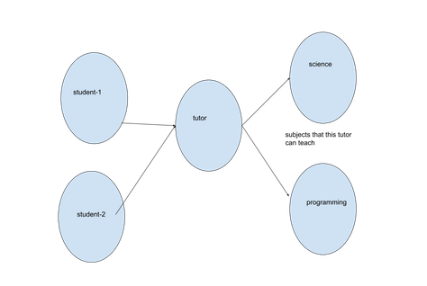

# jpa-query-assignment3

- [ ] don't forget coffe!

- [ ] Du behöver ha fyra klasser: Student,Tutor, Subject och Address för denna uppgift.
- [ ] Relationen mellan Tutor och Student är One to Many.
- [ ] Relationen mellan Tutor och Subject är Many to Many.
- [x] Laddar ner Hibernate mall
- [ ] För att uppdatera dina kunskaper, titta på bilderna och workshops om queries-1, queries2 och queries.3

## Uppgift-1- Navigera över relationer(med member of)
- [ ] Skriv en query för att få namnet på alla elever vars tutor kan undervisa i science.
- [ ] Vi kan skriva den här frågan på olika sätt. Men vad vi vill ha här är att använda member of .
- [ ] Studenterna ska hämtas från frågan. Sedan kan du använda en ‘for each loop’ för att skriva ut dem.
	- [ ] Detta accepteras inte om du hittar tutor från frågan(query) och sedan hittar eleverna till denna specifika tutor  med hjälp av Java-metoderna.

🔴 **Important Note:** 
Det vi vill ha är att få **namnet på ALLA(?) elever** vars handledare kan undervisa i t.ex. science.

